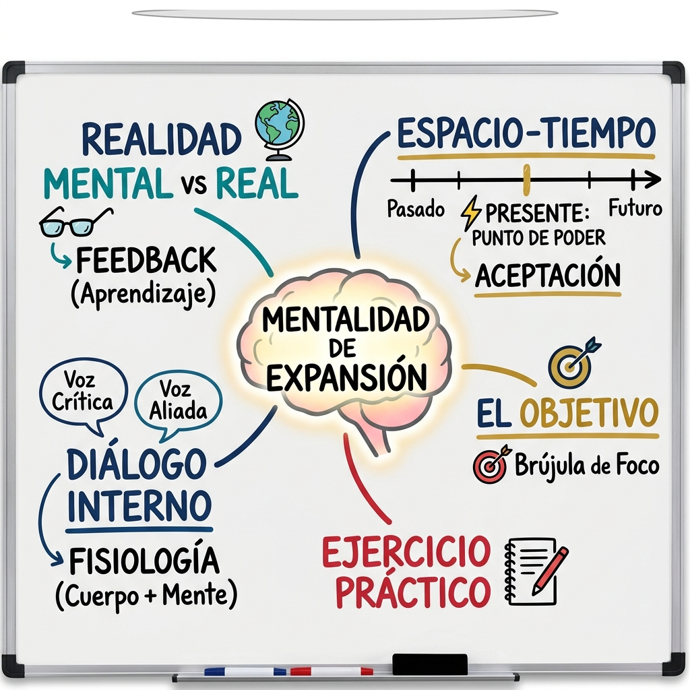

# 🧠 Esquema & Mapa Mental: Mentalidad de Expansión
> **Guía práctica para la charla y diseño paso a paso en pizarra**
> *Facilitadora: Marvelis Montero | Master Trainer en PNL*

---

## 🎨 Mapa Mental Ilustrado para la Pizarra

---

## 📋 1. Esquema de la Charla (Orden para la Laptop / Notas)

### **Título Central**: Mentalidad de Expansión
*Objetivo de la charla:* Llevar a los asistentes a tomar conciencia de cómo sus procesos internos determinan su realidad externa, activando su poder en el presente.

---

### **Punto 1: Realidad Mental vs. Realidad Real**
* **Idea clave:** No vivimos en la realidad, vivimos en la interpretación que hacemos de ella.
* **El Freno:** Vivir atrapados en películas mentales, supuestos y juicios internos distorsiona los hechos y paraliza la acción exterior.
* **Mensaje clave:** *"La realidad real es neutra y está llena de posibilidades; la realidad mental es la historia que te cuentas sobre ella."*

---

### **Punto 2: El Diálogo Interno**
* **Idea clave:** La conversación más importante del día es la que tienes contigo mismo.
* **El Enfoque:** Identificar al *Crítico Interno* (voz de duda/limitación) vs. el *Aliado Interno* (voz de posibilidad/expansión).
* **El Impacto:** El diálogo interno condiciona el estado emocional y la fisiología antes de dar cualquier paso.

---

### **Punto 3: El Espacio-Tiempo y el Punto de Poder**
* **Línea Temporal Mental:**
  * ❌ **Pasado:** Culpa, nostalgia, la historia que ya no se puede cambiar.
  * ❌ **Futuro:** Ansiedad, incertidumbre, el intento infructuoso de control.
  * ⚡ **PRESENTE (El Punto de Poder):** El único lugar, instante y espacio donde existe capacidad de decisión, respuesta y creación real.
* **Mensaje clave:** *"Toda expansión ocurre aquí y aquí. Tu foco en el presente es tu mayor superpoder."*

---

### **Punto 4: La Brújula: Tener un Objetivo**
* **Idea clave:** El objetivo no es para obsesionarse con el resultado final, sino para dirigir la energía del presente.
* **La Importancia:** Sin objetivo, la mente se dispersa en el diálogo interno y la ansiedad del futuro. Con objetivo, el cerebro activa el sistema de atención selectiva.
* **Mensaje clave:** *"El objetivo le da dirección al presente para que la energía no se fugue."*

---

### **Punto 5: Transición al Ejercicio Práctico**
* **Cierre de la Exposición:** Conexión entre la teoría dibujada en la pizarra y la vivencia en papel/cuaderno.
* **Paso al Ejercicio:** (Ejecución del ejercicio dinámico preparado).

---

## 🖌️ 3. Tips de Ilustración Rápida en Pizarra (Sin Necesidad de Diapositivas)

### 1. **Secuencia de Dibujo (Paso a Paso en la Pizarra)**
1. **Inicio de la Charla:** Dibuja en el centro exacto de la pizarra un **Cerebro en Expansión** con el título `MENTALIDAD DE EXPANSIÓN`. Usa la letra más grande aquí.
2. **Punto 1 (Izquierda Arriba):** Tira una rama. Dibuja unas **Gafas o Espejo** (Mente/Mundo) vs. un **Mundo o Globo** (Realidad Real).
3. **Punto 2 (Izquierda Abajo):** Tira una rama. Dibuja dos **Bocadillos de Diálogo** (💬). Pon la `Voz Crítica` vs. la `Voz Aliada`.
4. **Punto 3 (Derecha Arriba):** Tira una rama. Dibuja una **Línea de Tiempo** con 3 puntos (Pasado, Presente, Futuro). Marca el punto central con un **Rayo ⚡** escribiendo `PRESENTE (PUNTO DE PODER)`.
5. **Punto 4 (Derecha Centro):** Tira una rama. Dibuja una **Diana / Blanco con Flecha** (🎯) para `EL OBJETIVO`.
6. **Punto 5 (Centro Abajo):** Conecta la base del gráfico hacia abajo con un **Cuaderno y Lápiz** (📝) para `EJERCICIO PRÁCTICO`.
